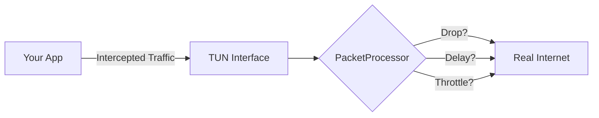

# 🌐 Network Simulator — Android VPN-based Network Interceptor


An Android APK that uses `VpnService` to intercept your target app's traffic on-device — **no laptop, no proxy server, no root required** — and applies configurable network degradation, **traffic shaping**, and **fault injection** in real time.

---

## 🚀 What it does (Network Chaos Testing)

The app acts as a local **Chaos Monkey** for your Android device. As a lightweight, on-device alternative to Charles Proxy, it creates a local VPN tunnel where, by specifying a target package name, only the traffic from your app under test is routed through the tunnel. It then applies configurable network degradation to perform **Network Chaos Testing**, while the rest of the device remains completely unaffected.



### 🎛️ Five Built-in Profiles

We offer an array of built-in profiles to simulate various network conditions:

| Profile | Latency | Jitter | Loss | Bandwidth | Use Case |
|---|---|---|---|---|---|
| 🐢 **Slow 3G** | `300 ms` | `±50 ms` | `1 %` | `100 kbps` | Simulates a poor cellular connection via **bandwidth throttling**. |
| 🕰️ **High Latency** | `1 000 ms` | `±200 ms` | `0.5 %` | unlimited | Evaluates **fault tolerance** and timeout resilience. |
| 🕳️ **Packet Loss** | `50 ms` | `±10 ms` | `20 %` | unlimited | Simulates an unstable connection for **Mobile SRE** scenarios. |
| 🚂 **Train (Real India)** | *Dynamic* | *Dynamic* | *Dynamic* | *Dynamic* | Cycles: *Good Signal* (30s) → *Signal Dip* (10s) → *Dead Zone* (5s). Tests **resilience** and recovery. |
| 🎚️ **Custom** | *Slider* | *Slider* | *Slider* | *Slider* | Build your own specific **adverse network conditions**. |

---

## 📊 Live Monitoring & Reporting **(NEW)**

The UI has been significantly upgraded to support professional QA and developer workflows:

* **Real-Time Stats:** Monitor live throughput (kbps), latency (ms), and packet loss (%) dynamically on your screen.
* **Screen Tagging:** Use the **Mark Screen** button to label specific user flows (e.g., "Login", "Checkout") in your simulation timeline.
### 📈 Beautiful Interactive HTML Reports

The crowning feature of Network Simulator is its standalone HTML reporting. After testing, instantly generate an offline-ready, single-file HTML report containing:
- **Interactive Metrics Chart**: Zoomable line charts built with Chart.js showing Throughput (kbps) and Latency (ms) synchronized per second.
- **Session Intelligence**: Automated interpretation of your session. For example, the tool will automatically detect and warn you if latency was abnormally high, or if packet loss exceeded expected thresholds.
- **Color-Coded Logs**: Scroll through a comprehensive table where each second is tagged:
  - 🟩 **Healthy** (Normal traffic)
  - 🟨 **Elevated latency** (e.g., >400ms)
  - 🟥 **Packet Loss** 
  - ⬜ **Idle** (No active traffic)
- **Flow Markers**: See exactly where your tagged flows ("Login", "Video Load") occurred along the timeline!

---

## 🛠️ Project structure

```text
app/src/main/
├── kotlin/com/networksimulator/
│   ├── MainActivity.kt              UI — profile cards, stats panel, export
│   ├── ui/
│   │   ├── MainViewModel.kt         ViewModel — VPN state, stats logging
│   │   └── StatsLogAdapter.kt       RecyclerView adapter for live logs
│   ├── model/
│   │   ├── NetworkProfile.kt        Data class for network conditions
│   │   └── SimulationConfig.kt      Config passed to the VPN service
│   ├── stats/
│   │   └── StatSnapshot.kt          Data structure for per-second metrics
│   └── vpn/
│       ├── NetworkSimulatorVpnService.kt   Core VpnService subclass
│       ├── PacketProcessor.kt              Drop / delay / throttle logic
│       ├── TcpConnectionTracker.kt         TCP connection state table
│       └── packet/
│           ├── IpPacket.kt          IPv4 header parser
│           ├── TcpPacket.kt         TCP segment parser
│           └── UdpPacket.kt         UDP datagram parser
└── AndroidManifest.xml
```

---

## 📋 Requirements

* **Android Studio:** Hedgehog (2023.1) or later
* **Android Gradle Plugin:** 8.3+
* **minSdk:** 26 (Android 8.0 Oreo)
* **Kotlin:** 1.9

---

## 🏗️ How to build

1. Open `NetworkSimulator/` in Android Studio — it will auto-sync Gradle.
2. Connect a device or start an emulator (API 26+).
3. Run → the app installs as **Network Simulator**.

---

## 🎮 How to use

1. **Pick a profile** — tap one of the five cards (e.g., *Train* or *Packet Loss*).
2. **Enter a target package** — type the package name of the app you want to test (e.g., `com.example.myapp`). Leave blank to intercept all apps.
3. **Start Simulation** — Tap the start button. Android will ask permission to create a VPN; tap **OK**.
4. **Monitor & Tag** — Watch the live stats panel. Use the **Mark Screen** feature to tag specific points in your testing journey.
5. **Stop & Export** — Stop the simulation, tap **Export Log**, and choose **HTML** to generate an interactive chart-based report. Find it in `Documents/NetworkSimulator`.

---

## 🏗 Architecture notes

### 🛡️ VPN tunnel
`NetworkSimulatorVpnService` calls `VpnService.Builder.establish()` which returns a `ParcelFileDescriptor` for the TUN interface. Raw IPv4 packets flow in via `FileInputStream(fd)` and responses are written back via `FileOutputStream(fd)`.

### ⏱️ Simulation pipeline (`PacketProcessor`)
Each packet goes through three gates:
1. **Drop gate** — `Random.nextFloat() * 100 < packetLossPercent`
2. **Latency gate** — `delay(latencyMs ± jitterMs)` (Kotlin coroutine suspend)
3. **Throttle gate** — token-bucket counting bytes in 1-second windows

### 🚀 UDP forwarding
Each UDP datagram is forwarded via a short-lived `DatagramChannel` whose underlying socket is protected with `VpnService.protect()`. This prevents the forwarding socket from looping back through the VPN tunnel.

### 🔄 TCP forwarding
`TcpConnectionTracker` maintains a `ConcurrentHashMap` of 4-tuples to `SocketChannel` instances. SYN packets open a new protected `SocketChannel`; subsequent data segments are forwarded through the existing channel. FIN/RST closes it.

> **Note:** The current TCP implementation is intentionally simplified — it does not reconstruct full TCP headers for the return path. A production-grade version would maintain per-connection sequence/ACK numbers and build correct TCP segments.

### 🎯 Restricting to one app
```kotlin
builder.addAllowedApplication("com.example.targetapp")
builder.addDisallowedApplication(packageName)  // exclude ourselves
```
If the package name is blank, `addAllowedApplication` is skipped and all traffic is intercepted.

---

## 🔮 Extending the project

* **Add IPv6 support** — add `addAddress("fd00::1", 128)` and `addRoute("::", 0)`, then handle IPv6 headers in `IpPacket`.
* **Profile hot-swap** — call `processor.profile = newProfile` from the service while running; `PacketProcessor` is already designed to handle this.
* **Production TCP proxy** — replace `TcpConnectionTracker` with a full TCP state machine (seq/ack tracking, window management, proper header reconstruction).
* **Embed in monitoring app** — the service can be moved to any app; just copy the `vpn/` package and add the manifest entries.
